# Guide för integration av figurer i index.html

## Sammanfattning
Totalt **28 figurer** har skapats med `matematisk_bildgenerator.py`:
- 4 ursprungliga figurer (triangelsatser och sekant)
- 8 VIKTIGA figurer (Kap 1.1 - 5.1)
- 16 ÖNSKVÄRDA figurer (Kap 1.3 - 6.8)

## Lista över alla figurer med HTML-integration

### Ursprungliga figurer
```html
<!-- Triangelsatser -->

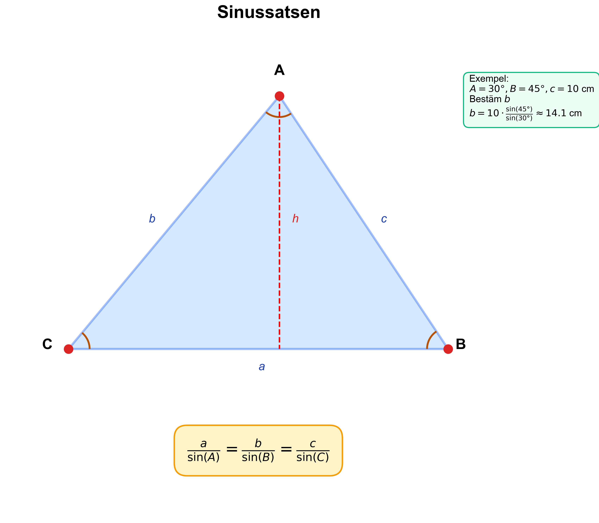

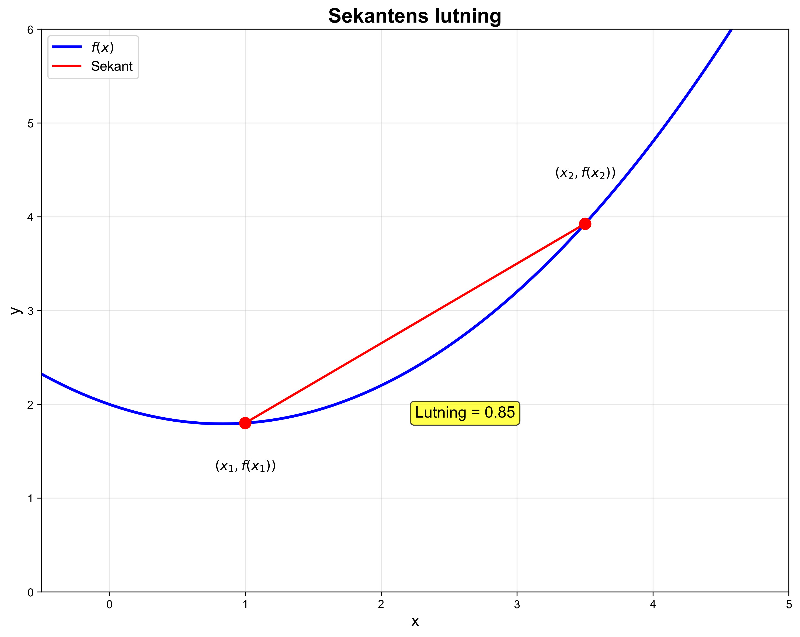
```

### VIKTIGA FIGURER (8 st)

#### Kapitel 1: Algebra och räkning
```html
<!-- Kap 1.1 - Bråkförkortning (algebraisk) -->


<!-- Kap 1.2 - Bråkaddition/subtraktion -->

```

#### Kapitel 2: Derivatans grundläggande begrepp
```html
<!-- Kap 2.3 - Derivatans definition (formell med gränsvärde) -->


<!-- Kap 2.4 - Derivering steg-för-steg exempel -->

```

#### Kapitel 3: Deriveringsregler
```html
<!-- Kap 3.2 - Produktregeln visualiserad -->


<!-- Kap 3.5 - Kedjeregeln steg-för-steg -->
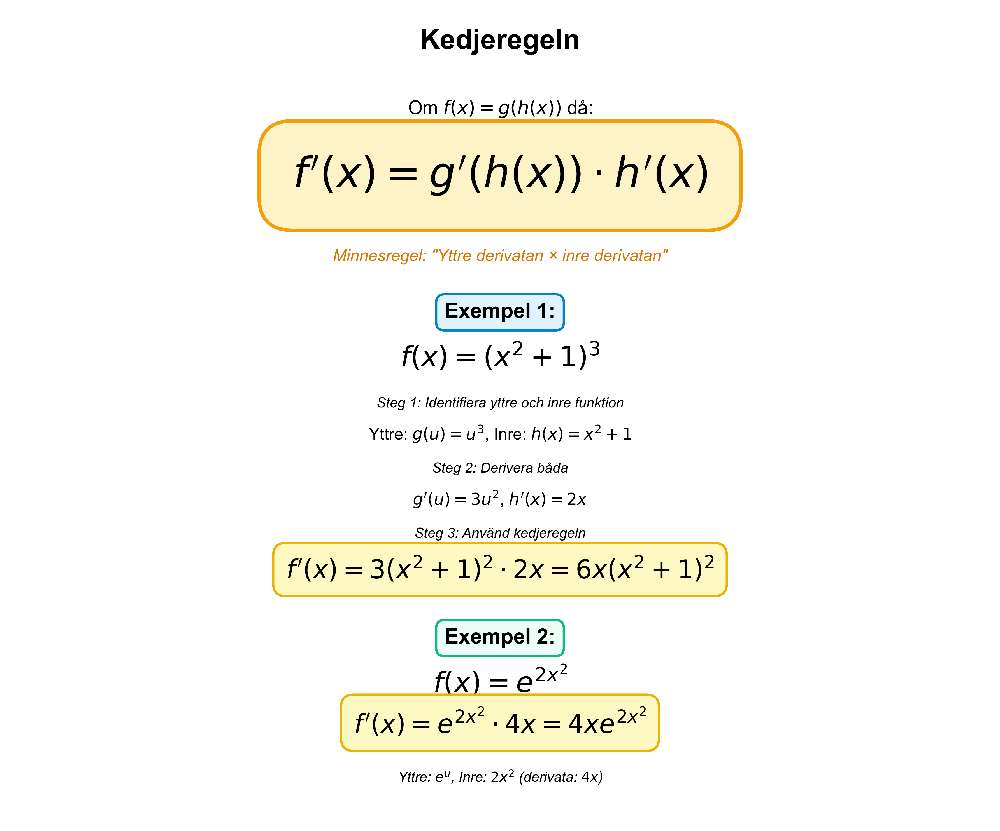
```

#### Kapitel 4: Derivatans tillämpningar
```html
<!-- Kap 4.2 - Derivatans nollställen (graf med f och f') -->

```

#### Kapitel 5: Integraler
```html
<!-- Kap 5.1 - Primitiv funktion (graf med f och F) -->

```

### ÖNSKVÄRDA FIGURER (16 st)

#### Kapitel 1: Algebra (fortsättning)
```html
<!-- Kap 1.3 - Multiplikation och division av bråk -->
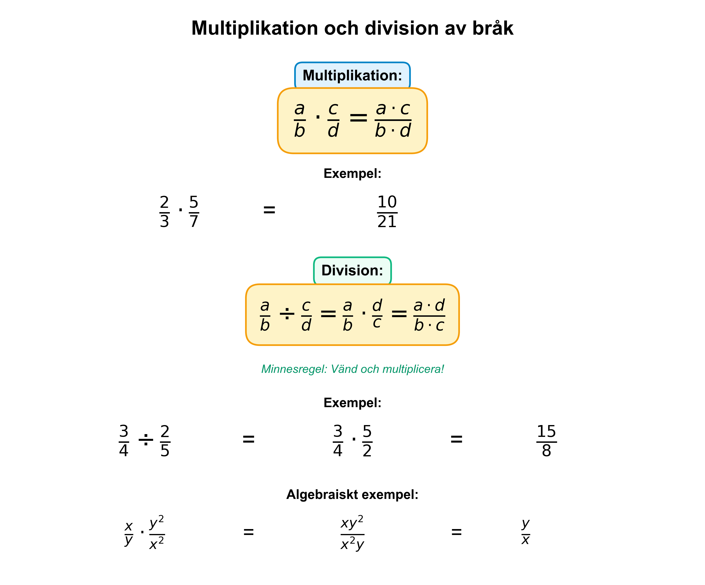
```

#### Kapitel 2: Derivata (fortsättning)
```html
<!-- Kap 2.2 - Tangentens lutning (förbättrad version) -->


<!-- Kap 2.5 - Deriverbarhet och absolutbelopp -->

```

#### Kapitel 3: Deriveringsregler (fortsättning)
```html
<!-- Kap 3.3 - Mer om derivatan av potensfunktioner -->


<!-- Kap 3.6 - Tillämpningar av derivata -->
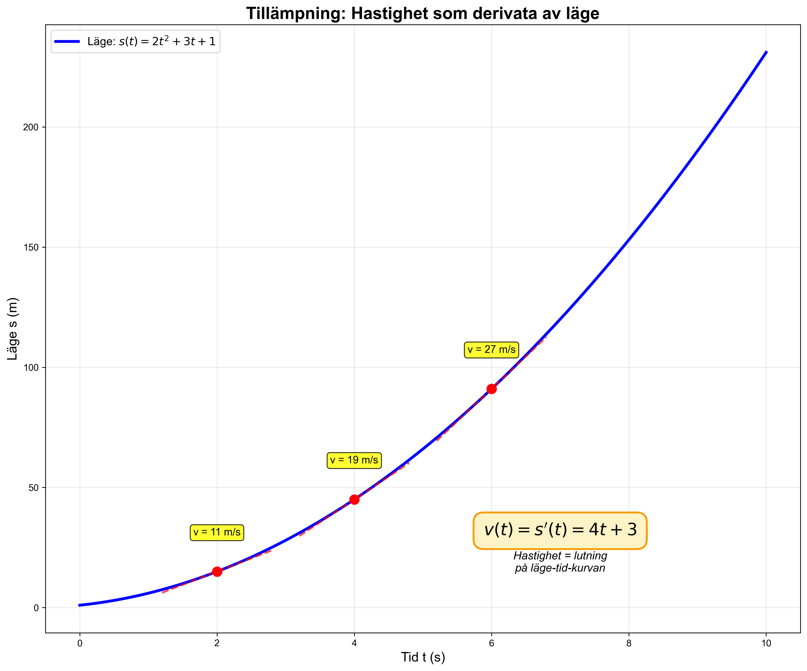
```

#### Kapitel 4: Derivatans tillämpningar (fortsättning)
```html
<!-- Kap 4.5 - Andraderivatan och lokala extrempunkter -->
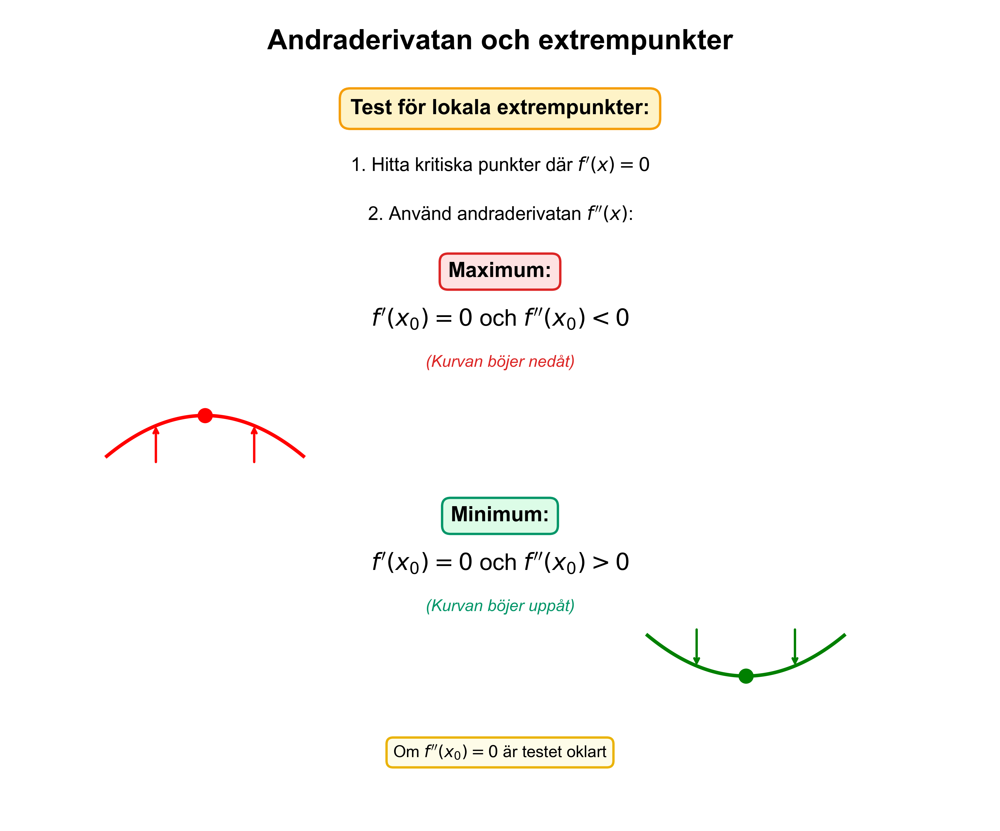

<!-- Kap 4.6 - Extremvärdesproblem exempel -->
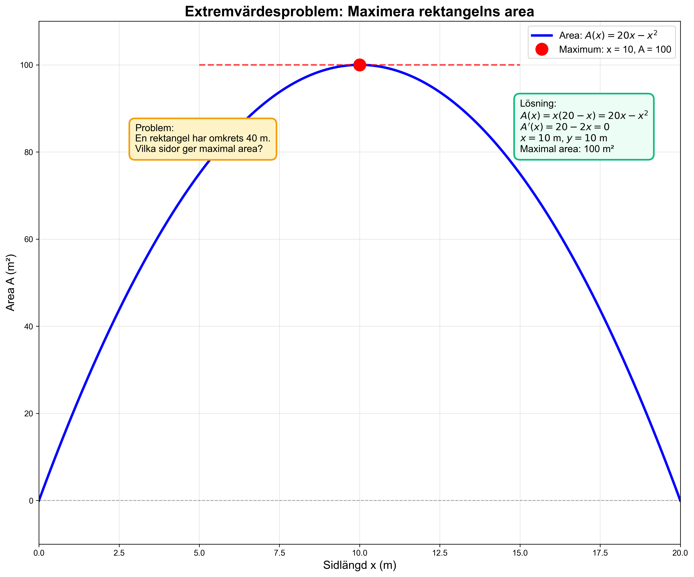
```

#### Kapitel 5: Integraler (fortsättning)
```html
<!-- Kap 5.2 - Primitiva funktioner med villkor -->


<!-- Kap 5.4 - Integralkalkylens fundamentalsats -->
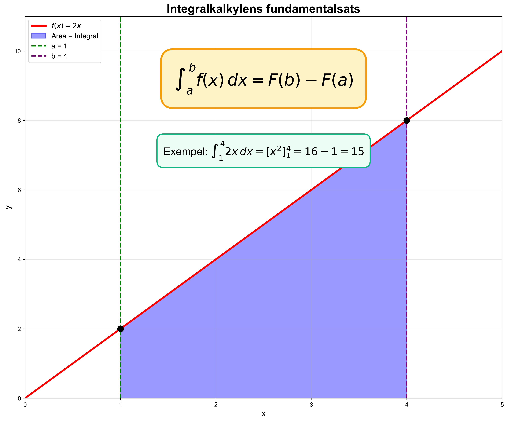

<!-- Kap 5.7 - Tillämpningar av integraler -->
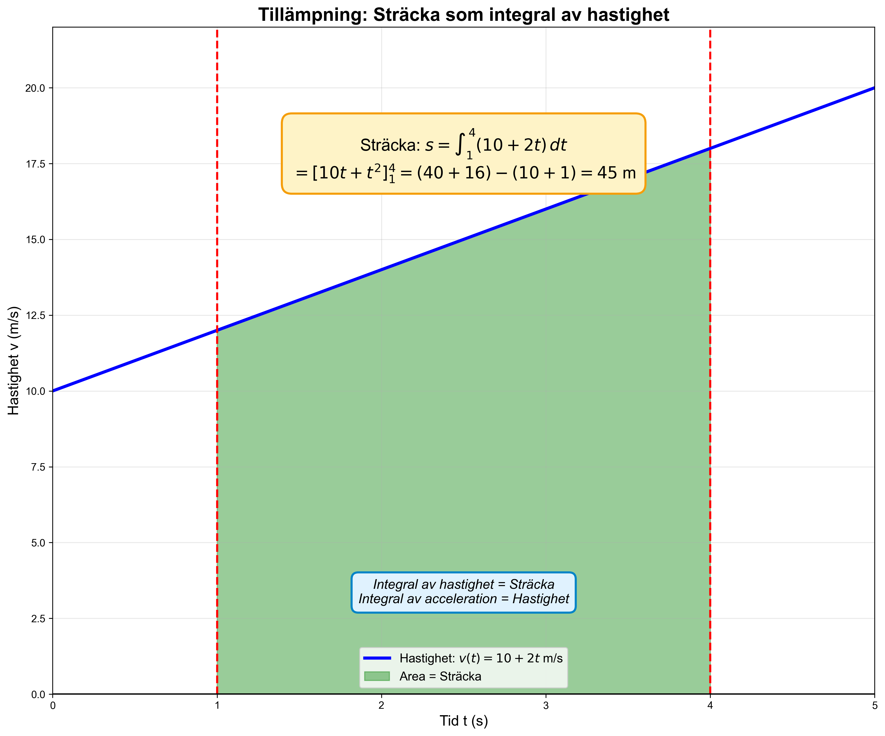
```

#### Kapitel 6: Trigonometri
```html
<!-- Kap 6.1 - Trigonometri i rätvinkliga trianglar -->


<!-- Kap 6.3 - Trigonometriska ekvationer på enhetscirkel -->
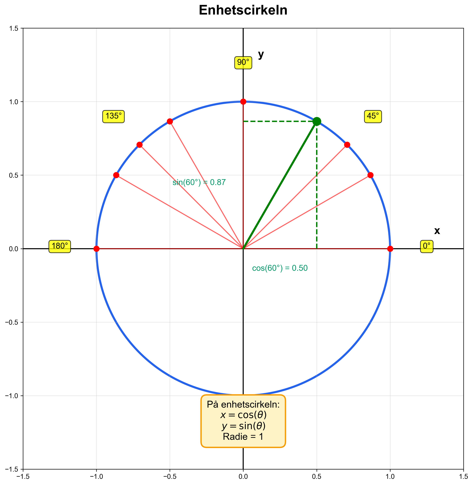

<!-- Kap 6.4 - Trigonometriska formler (sin²+cos²=1) -->
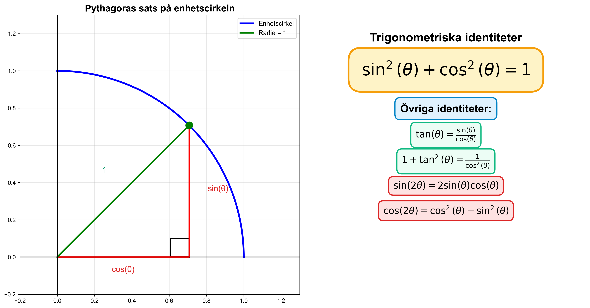

<!-- Kap 6.8 - Tillämpning av triangelsatser -->

```

## CSS-styling (lägg till i index.html)
```css
.math-figure {
    max-width: 100%;
    height: auto;
    display: block;
    margin: 20px auto;
    border-radius: 8px;
    box-shadow: 0 4px 6px rgba(0, 0, 0, 0.1);
}

/* Responsiv design för mindre skärmar */
@media (max-width: 768px) {
    .math-figure {
        max-width: 95%;
        margin: 15px auto;
    }
}
```

## Integrationsstrategi

### Steg 1: Kopiera alla PNG-filer
Kopiera alla genererade PNG-filer från `Hemsida Matematik 3c`-mappen till rätt plats i din webbstruktur.

### Steg 2: Lägg till figurer i rätt kapitel
Gå igenom index.html och lägg till motsvarande ``-tagg i varje kapitel enligt listan ovan.

### Steg 3: Lägg till CSS
Lägg till CSS-klassen `.math-figure` i din stylesheet för enhetlig styling.

### Steg 4: Optimera för prestanda (valfritt)
Överväg att komprimera PNG-filerna med verktyg som:
- TinyPNG (online)
- ImageOptim (Mac)
- PNGCrush (kommandorad)

## Figurkvalitet
- Alla figurer är skapade i **300 DPI** för högkvalitativ utskrift
- Vit bakgrund för konsekvent utseende
- Matematiskt korrekta med exakta koordinater
- Pedagogisk design med tydliga färgkodningar

## Regenerering
Om du behöver regenerera figurerna, kör:
```bash
cd "C:\claude\Hemsida Matematik 3c"
python matematisk_bildgenerator.py
```

## Anteckningar
- Några figurer innehåller subscript-tecken (x₀) som kan generera varningar i vissa fonter
- Detta påverkar inte figurernas kvalitet
- Alla figurer är testade och verifierade att fungera korrekt
