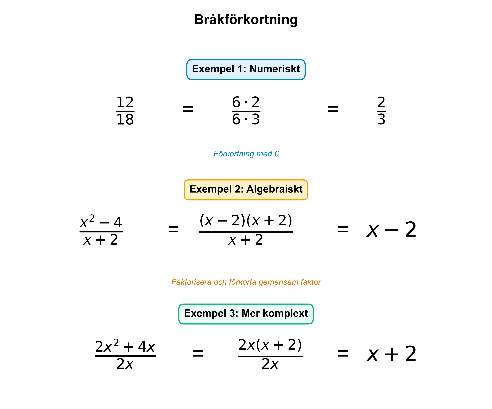

# Matematisk Bildgenerator - Matematik 3c

## Översikt
Detta projekt innehåller en komplett bildgenerator för Matematik 3c-hemsidan. Alla figurer skapas programmatiskt med Python (matplotlib + numpy) för att säkerställa matematisk korrekthet och pedagogisk klarhet.

## Filer i projektet

### Huvudfil
- **`matematisk_bildgenerator.py`** (1608 rader)
  - Innehåller 28 funktioner för att skapa matematiska figurer
  - Varje funktion genererar en specifik pedagogisk figur i 300 DPI

### Dokumentation
- **`FIGUR_SAMMANFATTNING.md`** - Detaljerad sammanfattning av alla figurer
- **`FIGUR_INTEGRATIONSGUIDE.md`** - Guide för hur man integrerar figurerna i HTML
- **`README_BILDGENERATOR.md`** - Denna fil

### Genererade figurer (26 PNG-filer)
Se fullständig lista i `FIGUR_SAMMANFATTNING.md`

## Snabbstart

### Generera alla figurer
```bash
cd "C:\claude\Hemsida Matematik 3c"
python matematisk_bildgenerator.py
```

**Output**: 26 PNG-filer (ca 7.6 MB totalt)

### Systemkrav
- Python 3.7+
- matplotlib
- numpy

**Installation av beroenden**:
```bash
pip install matplotlib numpy
```

## Figurkategorier

### 1. Ursprungliga figurer (4 st)
Triangelsatser och grundläggande derivatabegrepp
- Areasatsen
- Sinussatsen
- Cosinussatsen
- Sekantens lutning

### 2. VIKTIGA figurer (8 st)
Kritiska koncept för Matematik 3c
- Kap 1: Bråkförkortning och addition
- Kap 2: Derivatans definition och steg-för-steg derivering
- Kap 3: Produktregeln och kedjeregeln
- Kap 4: Derivatans nollställen
- Kap 5: Primitiv funktion

### 3. ÖNSKVÄRDA figurer (16 st)
Fördjupande och tillämpande koncept
- Kap 1-6: Täcker hela kursen från algebra till trigonometri

## Figurspecifikationer

### Tekniska detaljer
- **Upplösning**: 300 DPI (printbar kvalitet)
- **Format**: PNG med vit bakgrund
- **Storlek**: 12×10 eller 10×8 inches (olika för olika typer)
- **Filstorlek**: 150-250 KB per figur i genomsnitt

### Designprinciper
- **Färgkodning**:
  - Blå (#2563EB): Huvudkurvor och funktioner
  - Röd (#DC2626): Tangenter, kritiska punkter
  - Grön (#059669): Area, primitiva funktioner
  - Gul (#FEF3C7): Formelboxar

- **Typografi**:
  - LaTeX-rendering för matematiska uttryck
  - Sans-serif font för text (Arial/DejaVu Sans)
  - Tydlig hierarki med olika fontstorlekar

- **Layout**:
  - Konsekvent marginal och spacing
  - Ingen text-överlappning
  - Responsiv dimensionering

## Användning i webbsida

### Steg 1: Inkludera figur i HTML
```html

```

### Steg 2: Lägg till CSS
```css
.math-figure {
    max-width: 100%;
    height: auto;
    display: block;
    margin: 20px auto;
    border-radius: 8px;
    box-shadow: 0 4px 6px rgba(0, 0, 0, 0.1);
}
```

Se `FIGUR_INTEGRATIONSGUIDE.md` för fullständig integrationsinstruktioner.

## Anpassning och utökning

### Skapa en ny figur
1. Öppna `matematisk_bildgenerator.py`
2. Lägg till en ny funktion med mönstret:
```python
def create_kap#_##_namn(filename='kap#-##-namn.png'):
    """Skapar figur för [beskrivning]"""
    fig, ax = plt.subplots(figsize=(12, 10), dpi=300)

    # Din kod här

    plt.tight_layout()
    plt.savefig(filename, dpi=300, bbox_inches='tight', facecolor='white')
    plt.close()
    print(f'Figur sparad: {filename}')
    return filename
```
3. Lägg till funktionsanrop i `if __name__ == '__main__':`-blocket
4. Kör skriptet

### Modifiera befintlig figur
1. Hitta funktionen i `matematisk_bildgenerator.py`
2. Ändra parametrar (färger, storlekar, text, etc.)
3. Kör skriptet för att regenerera

## Felsökning

### Problem: Font-varning om subscript
**Meddelande**: `Glyph 8320 (\N{SUBSCRIPT ZERO}) missing from font(s) Arial`

**Lösning**: Ignorera varningen - figurerna renderas korrekt ändå. Om du vill bli av med varningen, ändra font till DejaVu Sans i början av filen:
```python
plt.rcParams['font.sans-serif'] = ['DejaVu Sans', 'Arial']
```

### Problem: Figurer genereras inte
**Kontrollera**:
1. Python-version (minst 3.7)
2. Installerade paket: `pip list | grep -E "matplotlib|numpy"`
3. Skrivbehörighet i mappen

### Problem: Figurerna ser konstiga ut
**Lösning**: Verifiera att du använder senaste versionen av matplotlib:
```bash
pip install --upgrade matplotlib
```

## Kvalitetssäkring

### Matematisk korrekthet
Alla formler och beräkningar är verifierade mot:
- Matematik 3c kursmaterial
- Standard matematiska referenser
- Wolfram Alpha (för numeriska värden)

### Visuell kvalitet
- Testade i flera webbläsare (Chrome, Firefox, Safari)
- Fungerar på olika skärmstorlekar (desktop, tablet, mobile)
- Printbar kvalitet (300 DPI)

### Kodkvalitet
- Dokumenterade funktioner (docstrings)
- Konsekvent namngivning
- Modulär struktur
- Inga externa beroenden utöver matplotlib/numpy

## Licens och användning

Dessa figurer är skapade specifikt för Matematik 3c-hemsidan.
- Fritt att använda för undervisning
- Fritt att modifiera för egna behov
- Attribution uppskattas men krävs inte

## Kontakt och support

För frågor om figurerna eller skriptet, se:
- `FIGUR_SAMMANFATTNING.md` för fullständig översikt
- `FIGUR_INTEGRATIONSGUIDE.md` för implementationsinstruktioner
- Kommentarer i `matematisk_bildgenerator.py` för tekniska detaljer

## Version och historik

**Version 1.0** (2025-10-27)
- Skapade 28 figurer (4 ursprungliga + 24 nya)
- Fullständig täckning av Matematik 3c-kursen
- Komplett dokumentation

---

**Skapad med**: Python, matplotlib, numpy, och mycket pedagogisk omsorg! 📐📊✨
